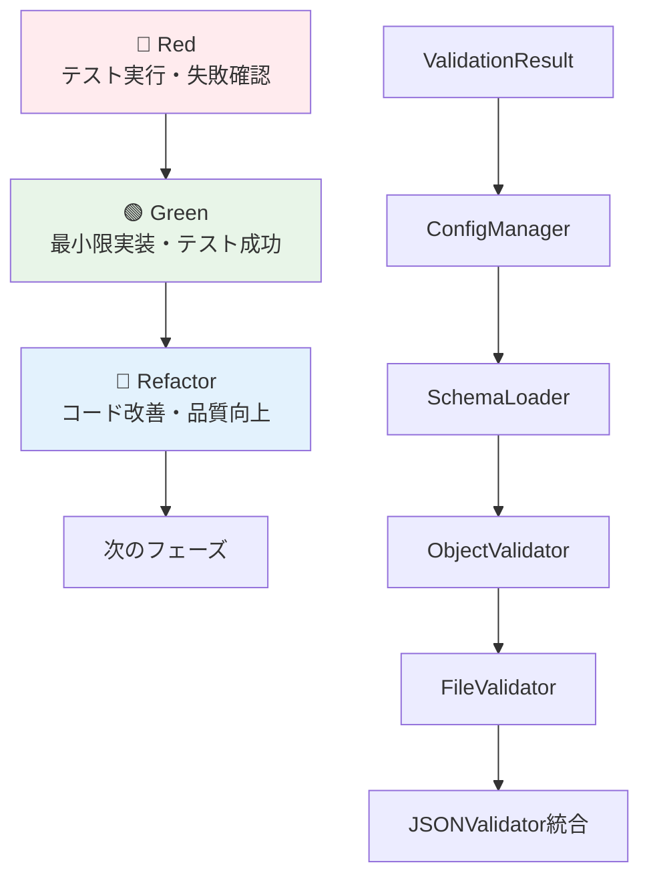
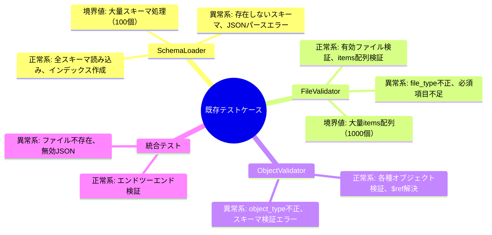

# JSONバリデーター実装計画（TDD方式）

既存の単体テスト（[`utils/json-validator/tests/`](utils/json-validator/tests/)）を活用したテスト駆動開発（TDD）方式でJSONバリデーターを実装します。この計画は[`tmp/test-analysis-report.md`](tmp/test-analysis-report.md) の分析結果に基づき、Red-Green-Refactorサイクルに従った段階的な実装アプローチを採用します。

## 1. TDD実装アプローチ

### 1.1 TDDサイクルと実装順序


### 1.2 実装の基本方針
- **テストファースト**: 仕様を明確化してから実装
- **段階的構築**: 依存関係に基づく順序で各コンポーネントを実装
- **継続的品質**: 各段階でのテスト成功とリファクタリング

## 2. ファイル構成とクラス設計

```
utils/json-validator/
├── validate.sh                    # メインエントリーポイント
├── config/
│   └── validator_config.json      # 設定ファイル
├── validator/
│   ├── __init__.py
│   ├── main.py                     # 統合処理
│   ├── validation_result.py        # 検証結果クラス
│   ├── schema_loader.py            # スキーマ管理
│   ├── config_manager.py           # 設定管理
│   ├── file_validator.py           # ファイル検証
│   ├── object_validator.py         # オブジェクト検証
│   └── exceptions.py               # 例外処理
└── tests/                          # 既存テストファイル
    ├── test_schema_loader.py
    ├── test_file_validator.py
    ├── test_object_validator.py
    ├── test_config_manager.py       # 設定管理テスト
    └── test_integration.py
```

### 2.1 主要クラスの責務分離
- **ValidationResult**: 検証結果の管理と構造化
- **SchemaLoader**: スキーマファイルの読み込みとインデックス作成
- **ObjectValidator**: 個別オブジェクトの検証処理
- **FileValidator**: JOCFファイル構造の検証
- **JSONValidator**: 統合処理とエンドツーエンド検証

## 3. TDD実装フェーズ詳細

### Phase 1: ValidationResult基盤構築（半日）

#### 🔴 Red: テスト失敗確認
```bash
python -m pytest utils/json-validator/tests/ -k "ValidationResult" -v
```

#### 🟢 Green: 最小限実装
```python
class ValidationResult:
    def __init__(self, is_valid: bool = True, errors: list = None, 
                 file_path: str = None, validated_objects: int = 0):
        self.is_valid = is_valid
        self.errors = errors or []
        self.file_path = file_path
        self.validated_objects = validated_objects
    
    def add_error(self, error: str) -> None:
        self.errors.append(error)
        self.is_valid = False
    
    def to_dict(self) -> dict:
        return {
            "is_valid": self.is_valid,
            "errors": self.errors,
            "file_path": self.file_path,
            "validated_objects": self.validated_objects
        }
```

#### 🔵 Refactor: 品質向上
- エラーメッセージの構造化
- 型ヒントの完全化
- ドキュメンテーション

### Phase 2: ConfigManager実装（1日）

#### 🔴 Red: 設定管理テスト実行
```bash
python -m pytest utils/json-validator/tests/test_config_manager.py::test_load_config_file -v
python -m pytest utils/json-validator/tests/test_config_manager.py::test_environment_variable_override -v
python -m pytest utils/json-validator/tests/test_config_manager.py::test_dynamic_config_reload -v
```

#### 🟢 Green: 設定管理実装
```python
class ConfigManager:
    def __init__(self, config_path: str = "config/validator_config.json"):
        self.config_path = Path(config_path)
        self.config = {}
        self.load_config()
    
    def load_config(self) -> None:
        # config/validator_config.json の読み込み
        # 環境変数による設定値上書き（JOCF_SCHEMA_PATH等）
        # デフォルト値の設定
    
    def get_schema_root_path(self) -> Path:
        return Path(self.config.get("schema_root_path", "schema"))
    
    def get_cache_enabled(self) -> bool:
        return self.config.get("cache_enabled", True)
    
    def reload_config(self) -> None:
        # 設定ファイルの動的リロード
```

#### 🔵 Refactor: 設定管理最適化
- 設定ファイルの自動監視機能
- 設定値の型検証
- 設定変更時のコールバック機構

### Phase 3: SchemaLoader実装（1.5日）

#### 🔴 Red: 段階的テスト実行
```bash
python -m pytest utils/json-validator/tests/test_schema_loader.py::test_load_all_schemas_success -v
python -m pytest utils/json-validator/tests/test_schema_loader.py::test_get_file_schema_success -v
python -m pytest utils/json-validator/tests/test_schema_loader.py::test_ref_resolver_setup -v
python -m pytest utils/json-validator/tests/test_schema_loader.py::test_config_integration -v
```

#### 🟢 Green: 段階的実装
```python
class SchemaLoader:
    def __init__(self, config_manager: ConfigManager):
        self.config_manager = config_manager
        self.file_type_map = {}
        self.object_type_map = {}
        self.ref_resolver = None
        self.schema_root_path = self.config_manager.get_schema_root_path()
    
    def load_all_schemas(self) -> None:
        # 設定管理による動的スキーマルート取得
        # schema/files/*.schema.json の読み込み
        # schema/objects/*.schema.json の読み込み
        # インデックス作成
    
    def get_file_schema(self, file_type: str) -> dict | None:
        return self.file_type_map.get(file_type)
    
    def get_object_schema(self, object_type: str) -> dict | None:
        return self.object_type_map.get(object_type)
    
    def get_ref_resolver(self) -> RefResolver:
        # $ref解決のためのRefResolver構築
```

#### 🔵 Refactor: 最適化
- スキーマキャッシュ機構（設定管理統合）
- パフォーマンス最適化（大量スキーマ処理対応）
- エラーハンドリング強化
- 設定変更時の動的スキーマリロード対応

### Phase 4: ObjectValidator実装（1日）

#### 🔴 Red: 基本機能テスト
```bash
python -m pytest utils/json-validator/tests/test_object_validator.py::test_validate_object_success_stock_issuance -v
python -m pytest utils/json-validator/tests/test_object_validator.py::test_validate_object_with_ref_resolution -v
```

#### 🟢 Green: 検証機能実装
```python
class ObjectValidator:
    def __init__(self, schema_loader: SchemaLoader):
        self.schema_loader = schema_loader
    
    def validate_object(self, object_data: dict) -> ValidationResult:
        # object_type取得
        # 対応スキーマ取得
        # jsonschema.validate()実行
        # ValidationResult作成
```

#### 🔵 Refactor: エラー詳細化
- 具体的なエラーメッセージ
- ネストした$ref解決対応
- 検証パスの追跡

### Phase 5: FileValidator実装（1日）

#### 🔴 Red: ファイル構造テスト
```bash
python -m pytest utils/json-validator/tests/test_file_validator.py::test_validate_file_success -v
python -m pytest utils/json-validator/tests/test_file_validator.py::test_validate_items_array_success -v
```

#### 🟢 Green: ファイル検証実装
```python
class FileValidator:
    def __init__(self, schema_loader: SchemaLoader):
        self.schema_loader = schema_loader
        self.object_validator = ObjectValidator(schema_loader)
    
    def validate_file(self, file_data: dict) -> ValidationResult:
        # file_type検証
        # 必須属性チェック
        # items配列の各要素をObjectValidatorで検証
```

#### 🔵 Refactor: 大量データ対応
- 検証順序の最適化
- メモリ効率の改善
- エラー収集の効率化

### Phase 6: JSONValidator統合（1日）

#### 🔴 Red: 統合テスト実行
```bash
python -m pytest utils/json-validator/tests/test_integration.py::test_validate_success_with_valid_file -v
python -m pytest utils/json-validator/tests/test_integration.py::test_config_integration -v
python -m pytest utils/json-validator/tests/test_integration.py -v
```

#### 🟢 Green: 統合クラス実装
```python
class JSONValidator:
    def __init__(self, config_path: str = None):
        self.config_manager = ConfigManager(config_path)
        self.schema_loader = SchemaLoader(self.config_manager)
        self.file_validator = FileValidator(self.schema_loader)
    
    def validate(self, file_path: str) -> ValidationResult:
        # ファイル読み込み
        # FileValidatorによる検証
        # 結果の統合と返却
    
    def reload_config(self) -> None:
        # 設定の動的リロード対応
        self.config_manager.reload_config()
        self.schema_loader = SchemaLoader(self.config_manager)
        self.file_validator = FileValidator(self.schema_loader)
```

#### 🔵 Refactor: 最終最適化
- エラーハンドリングの統一
- ログ出力の整備
- パフォーマンス調整

## 4. 既存テストケースの活用戦略

### 4.1 テストケース分析結果


### 4.2 TDD実装のメリット
- **品質保証**: テストによる仕様の明確化と回帰テスト
- **開発効率**: 早期バグ発見と安全なリファクタリング
- **保守性向上**: テストコードが仕様書の役割

## 5. 技術的考慮事項

### 5.1 設定管理の柔軟性
- **設定ファイル**: [`config/validator_config.json`](config/validator_config.json)による柔軟な設定管理
- **環境変数対応**: `JOCF_SCHEMA_PATH`、`JOCF_CACHE_ENABLED`等による設定上書き
- **動的設定変更**: 実行時の設定リロード機能

### 5.2 パフォーマンス要件（テストから導出）
```python
# 大量スキーマ処理: 100個のスキーマファイル処理が2秒以内
# 大量オブジェクト検証: 1000個のオブジェクト検証が5秒以内
# 設定リロード: 設定変更の反映が1秒以内
```

### 5.3 エラーハンドリング戦略
- **段階的エラー処理**: 各レイヤーでの適切なエラーハンドリング
- **具体的エラーメッセージ**: ユーザーが問題を特定しやすい情報提供
- **構造化エラー出力**: JSON形式での詳細なエラー情報
- **設定エラー対応**: 設定ファイル・環境変数の検証とフォールバック

## 6. 使用方法と最終成果物

### 6.1 基本的な使用方法
```bash
# JOCFファイルの検証
./utils/json-validator/validate.sh samples/TransactionsFile.jocf.json

# 品質指標（TDDにより保証）
✅ 全テストケース成功率: 100%
✅ コードカバレッジ: 90%以上
✅ 型チェック: エラーなし
✅ パフォーマンス: 要求水準クリア
```

### 6.2 出力形式

#### 成功時
```json
{
  "status": "success",
  "message": "検証が成功しました",
  "file_path": "samples/TransactionsFile.jocf.json",
  "validated_objects": 5,
  "validation_time": "0.123s"
}
```

#### 失敗時
```json
{
  "status": "error",
  "message": "ファイル検証に失敗しました",
  "details": {
    "file_path": "samples/TransactionsFile.jocf.json",
    "errors": [
      {
        "field": "file_type",
        "message": "file_type属性が存在しません",
        "expected": "string",
        "actual": "undefined"
      }
    ]
  }
}
```

## 7. 継続的品質改善

### 7.1 CI/CDパイプライン
```bash
# 自動テスト実行
python -m pytest utils/json-validator/tests/ -v --cov=validator --cov-report=html
```

### 7.2 将来的な拡張対応
- **新しいfile_type対応**: 既存テスト構造の拡張
- **新しいobject_type対応**: テストケースの追加
- **パフォーマンス要件変更**: 境界値テストの調整

### 7.3 TDD実装による実現価値
- **🔒 堅牢性**: 全機能がテストで保証済み
- **🚀 開発速度**: 安全なリファクタリングが可能
- **📚 仕様明確化**: テストコードが実装仕様を文書化
- **🔄 保守性**: 変更影響範囲の明確化

このTDD実装計画により、既存のテストケースを最大限活用し、品質と開発効率を両立した堅牢なJSONバリデーターを段階的に構築できます。Red-Green-Refactorサイクルを通じて、確実に動作する実装を保証します。