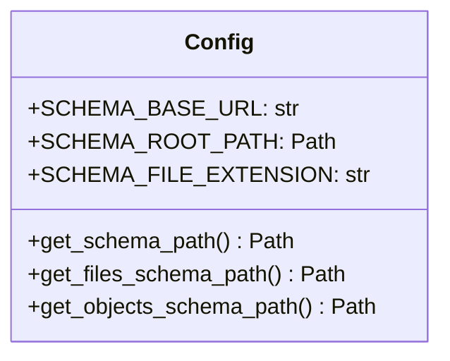
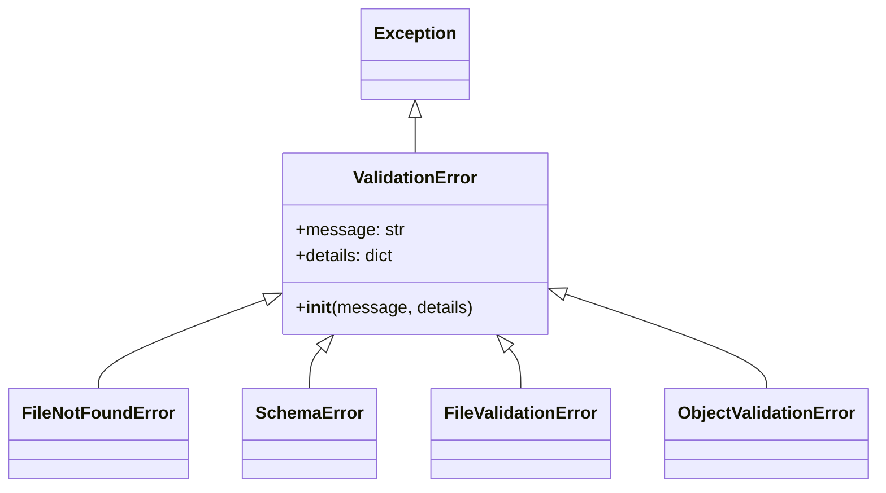
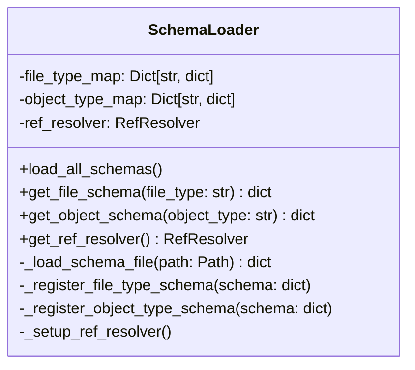
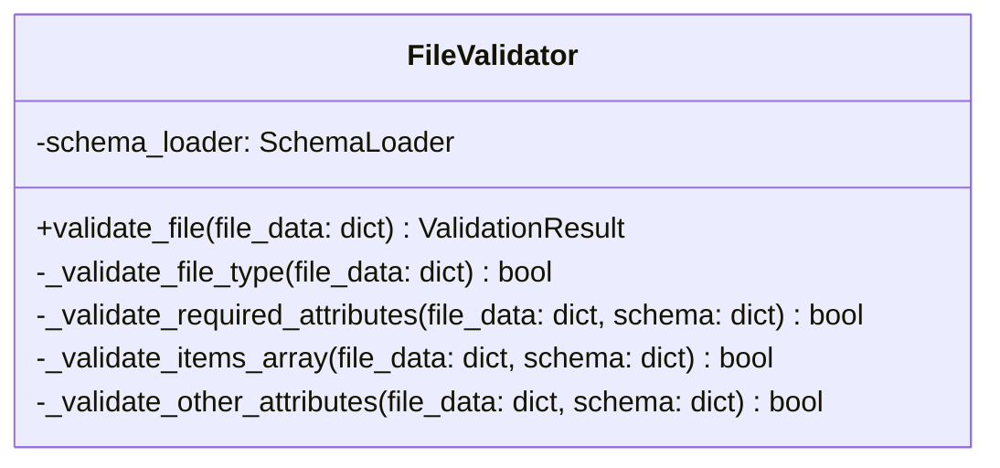
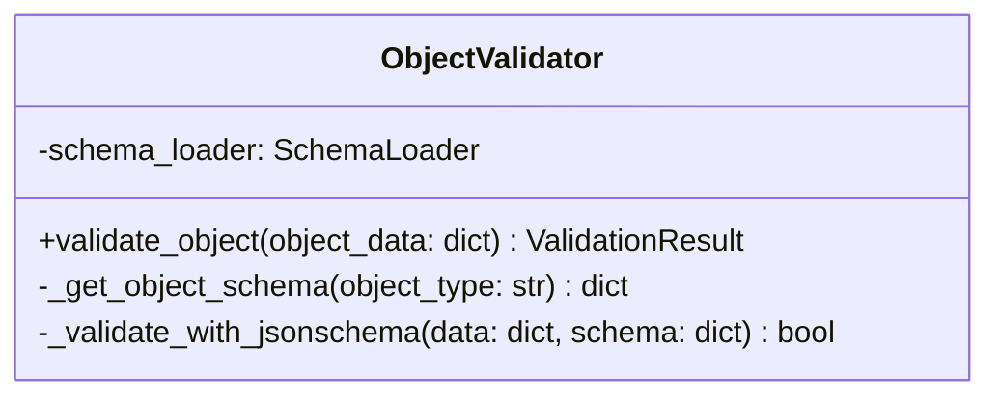
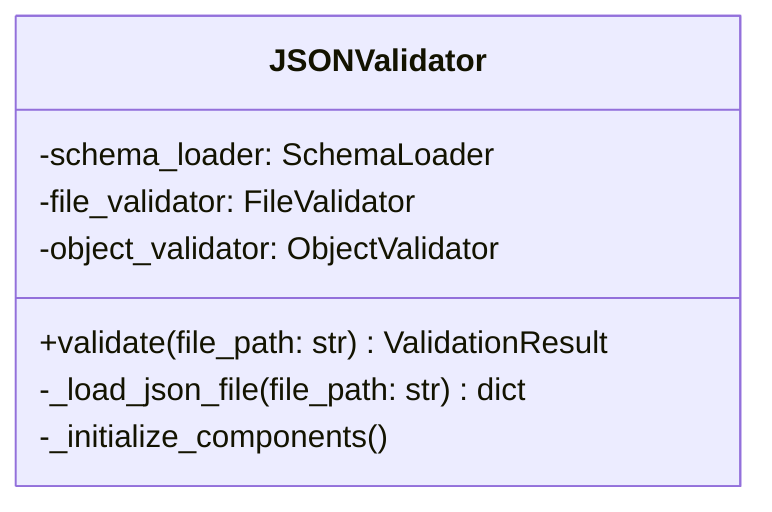
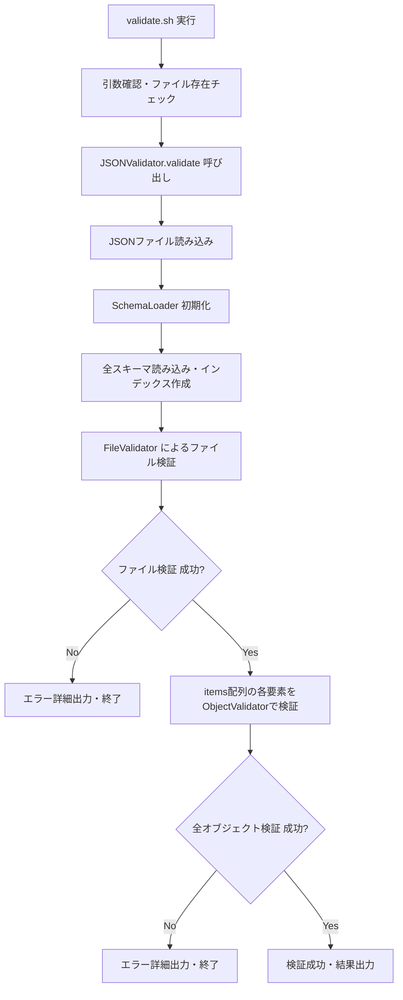
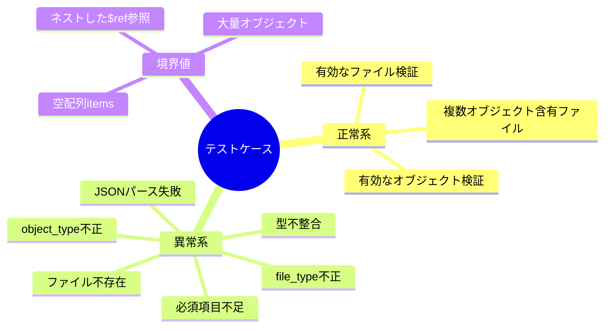

# JSONバリデーター実装計画

プロジェクト構造を分析し、要求事項を詳しく確認した結果、シンプルで保守性を重視した設計でJSONバリデーターの詳細な実装計画を策定いたしました。

## 1. ファイル構成とディレクトリ構造

```
utils/json-validator/
├── validate.sh                    # メインエントリーポイント（シェルスクリプト）
├── validator/
│   ├── __init__.py
│   ├── main.py                     # メイン処理の統括
│   ├── config.py                   # 設定値とパス管理
│   ├── schema_loader.py            # スキーマ読み込み・インデックス作成
│   ├── file_validator.py           # ファイル検証処理
│   ├── object_validator.py         # オブジェクト検証処理
│   └── exceptions.py               # カスタム例外クラス
├── tests/
│   ├── __init__.py
│   ├── test_schema_loader.py
│   ├── test_file_validator.py
│   ├── test_object_validator.py
│   └── test_integration.py
└── README.md                       # 使用方法とドキュメント
```

## 2. 各Pythonモジュールの責務と設計

### 2.1 config.py - 設定値管理

- スキーマファイルのパス管理
- 既存のutils/generate-docs/schema_config.pyと統一性を保持

### 2.2 exceptions.py - エラーハンドリング


### 2.3 schema_loader.py - スキーマ管理


### 2.4 file_validator.py - ファイル検証


### 2.5 object_validator.py - オブジェクト検証


### 2.6 main.py - メイン処理統括


## 3. 処理フロー図



## 4. エラーハンドリング戦略

### 4.1 エラーレベル分類
- **CRITICAL**: ファイル読み込み不可、スキーマファイル破損
- **ERROR**: 検証失敗（必須項目不足、型不整合）
- **WARNING**: 推奨項目不足、非推奨パターン使用

### 4.2 エラーメッセージ形式
```json
{
  "status": "error",
  "level": "ERROR",
  "message": "ファイル検証に失敗しました",
  "details": {
    "file_path": "/path/to/file.json",
    "validation_type": "file_validation",
    "errors": [
      {
        "field": "file_type",
        "message": "file_type属性が存在しません",
        "expected": "string",
        "actual": "undefined"
      }
    ]
  }
}
```

## 5. テスト戦略

### 5.1 テストレベル
- **単体テスト**: 各モジュールの個別機能テスト
- **統合テスト**: モジュール間連携テスト
- **エンドツーエンドテスト**: シェルスクリプトからPythonまでの全体テスト

### 5.2 テストケース設計


## 6. 実装順序とマイルストーン

### Phase 1: 基盤構築（1-2日）
1. ディレクトリ構造作成
2. config.py - 設定管理
3. exceptions.py - エラークラス定義
4. 基本的な単体テスト作成

### Phase 2: スキーマ管理（2-3日）
1. schema_loader.py - スキーマ読み込み・インデックス作成
2. RefResolver設定
3. スキーマローダーのテスト

### Phase 3: 検証エンジン（3-4日）
1. object_validator.py - オブジェクト検証（シンプルな機能から）
2. file_validator.py - ファイル検証
3. 検証ロジックのテスト

### Phase 4: 統合・UI（1-2日）
1. main.py - メイン処理統括
2. validate.sh - シェルスクリプト
3. 統合テスト・エンドツーエンドテスト

### Phase 5: 最終調整（1日）
1. エラーメッセージ改善
2. ドキュメント作成
3. samples/配下での動作確認

## 7. 技術的考慮事項

### 7.1 パフォーマンス
- スキーマファイルの一度読み込み・キャッシュ
- RefResolverの事前構築による高速$ref解決
- 大量データ処理時のメモリ効率

### 7.2 拡張性
- 新しいfile_type・object_typeの自動対応
- カスタムバリデーションルールの追加可能性
- 他のJSONスキーマバージョンへの対応

### 7.3 保守性
- 責務の明確な分離
- 設定の外部化
- 豊富なログ出力
- わかりやすいエラーメッセージ

## 8. 実装詳細

### 8.1 要求事項に基づく実装ポイント

#### 前処理 - インデックス作成
1. **file_type_map**: schema/files/*.schema.json から file_type をキーとするマップ作成
2. **object_type_map**: schema/objects/*.schema.json から object_type をキーとするマップ作成
3. **RefResolver**: 全スキーマファイルの $id をキーとするリゾルバー作成

#### ファイル検証処理
1. **file_type 検証**: ファイルオブジェクトの file_type を確認し、対応するスキーマを特定
2. **必須属性チェック**: スキーマの required 属性に基づく検証
3. **items配列型チェック**: 各要素の object_type が許可されているかチェック
4. **個別オブジェクト検証**: items配列の各要素に対するオブジェクト検証実行

#### オブジェクト検証処理
1. **object_type 特定**: オブジェクトの object_type から対応するスキーマを特定
2. **jsonschema 検証**: RefResolver を使用した完全な JSON Schema 検証

### 8.2 既存プロジェクトとの統合
- [`utils/generate-docs/schema_config.py`](utils/generate-docs/schema_config.py:1) のパス管理方式を参考
- プロジェクトルートからの相対パス管理を統一
- 既存の requirements.txt に jsonschema 依存を追加

## 9. 使用方法（予定）

```bash
# 基本的な使用方法
./utils/json-validator/validate.sh samples/TransactionsFile.jocf.json

# 成功時の出力例
{
  "status": "success",
  "message": "検証が成功しました",
  "file_path": "samples/TransactionsFile.jocf.json",
  "validated_objects": 5
}

# 失敗時の出力例
{
  "status": "error",
  "message": "ファイル検証に失敗しました",
  "details": {
    "file_path": "samples/TransactionsFile.jocf.json",
    "errors": [...]
  }
}
```

この計画では、シンプルな構成を保ちながら、要求事項を満たす堅牢なJSONバリデーターを段階的に実装できます。既存のプロジェクト構造との整合性も保ち、将来的な拡張にも対応可能な設計となっています。